# Multi-step form

Repositorio del código con el cual he creado mi proyecto Multi-step form dado como challenge en la página [Front End Mentor](https://www.frontendmentor.io/challenges/multistep-form-YVAnSdqQBJ). El nivel de dificultad del proyecto es de nivel 4: ADVANCED

## Tabla de Contenido

- [Multi-step form](#multi-step-form)
  - [Tabla de Contenido](#tabla-de-contenido)
  - [Screenshots de Views](#screenshots-de-views)
    - [Views on Desktop size](#views-on-desktop-size)
      - [1. Step 1: Personal Info Desktop](#1-step-1-personal-info-desktop)
        - [1.1 Step 1: Personal Info Desktop Validaciones](#11-step-1-personal-info-desktop-validaciones)
      - [2. Step 2: Plan Monthly Desktop](#2-step-2-plan-monthly-desktop)
        - [2.1. Step 2: Plan Yearly Desktop](#21-step-2-plan-yearly-desktop)
      - [3. Step 3: Add-ons Desktop](#3-step-3-add-ons-desktop)
      - [4. Step 4: Summary Yearly Desktop](#4-step-4-summary-yearly-desktop)
        - [4.1. Step 4: Summary Monthly Desktop](#41-step-4-summary-monthly-desktop)
      - [5. Step 5: Thanks Desktop](#5-step-5-thanks-desktop)
    - [Views on Mobile size](#views-on-mobile-size)
      - [1. Step 1 Mobile](#1-step-1-mobile)
        - [1.1. Step 1 Validaciones Mobile](#11-step-1-validaciones-mobile)
      - [2. Step 2 Plan Monthly Mobile](#2-step-2-plan-monthly-mobile)
        - [2.1. Step 2 Yearly Mobile](#21-step-2-yearly-mobile)
      - [3. Step 3 Add-ons Mobile](#3-step-3-add-ons-mobile)
      - [4. Step 4 Summary Mobile](#4-step-4-summary-mobile)
      - [5. Step 5 Thanks Mobile](#5-step-5-thanks-mobile)

## Screenshots de Views

### Views on Desktop size

#### 1. Step 1: Personal Info Desktop

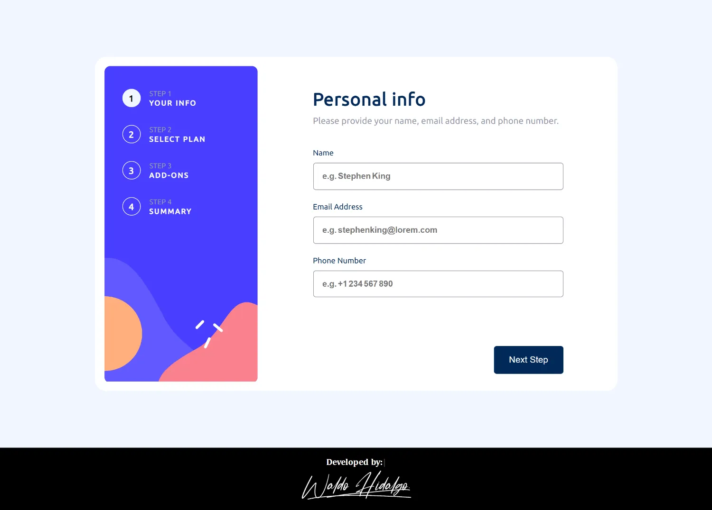

##### 1.1 Step 1: Personal Info Desktop Validaciones

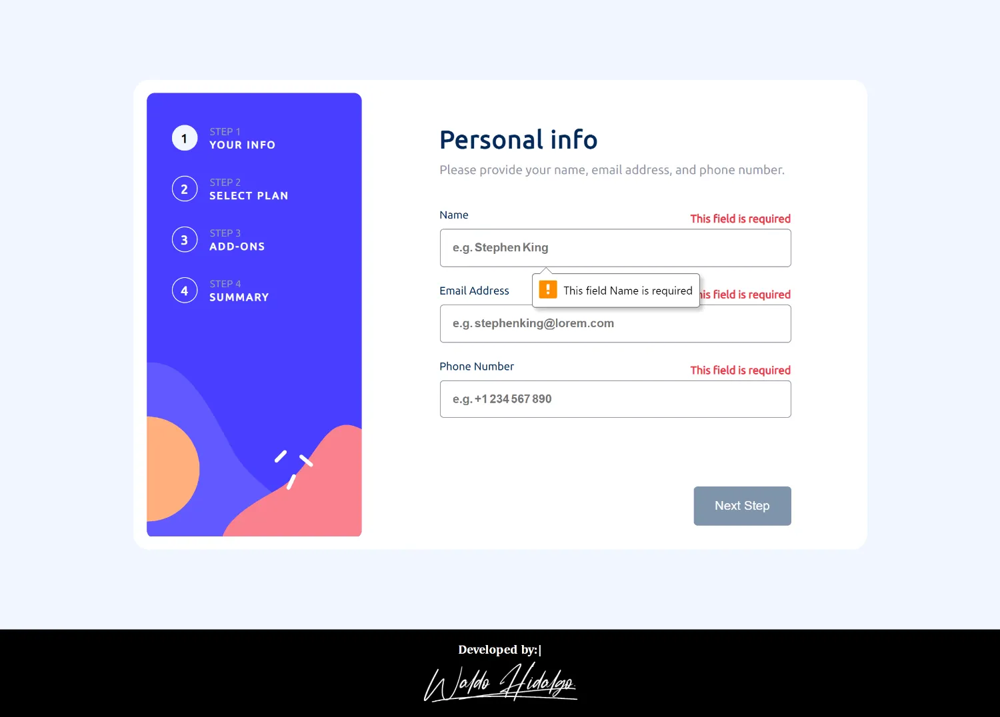

#### 2. Step 2: Plan Monthly Desktop

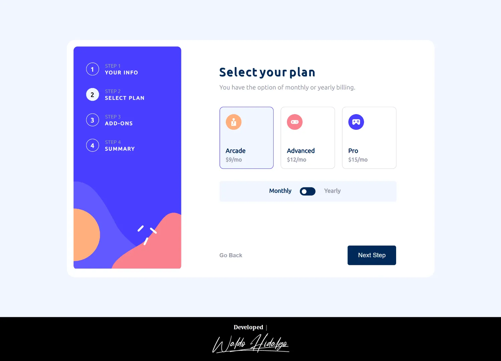

##### 2.1. Step 2: Plan Yearly Desktop

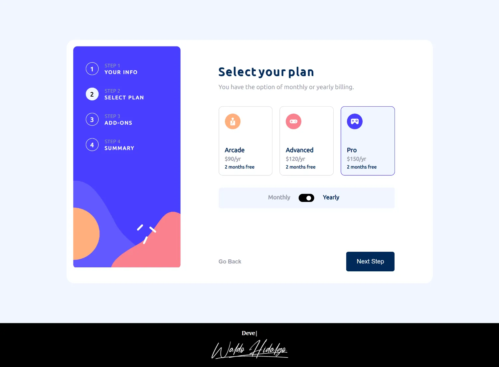

#### 3. Step 3: Add-ons Desktop

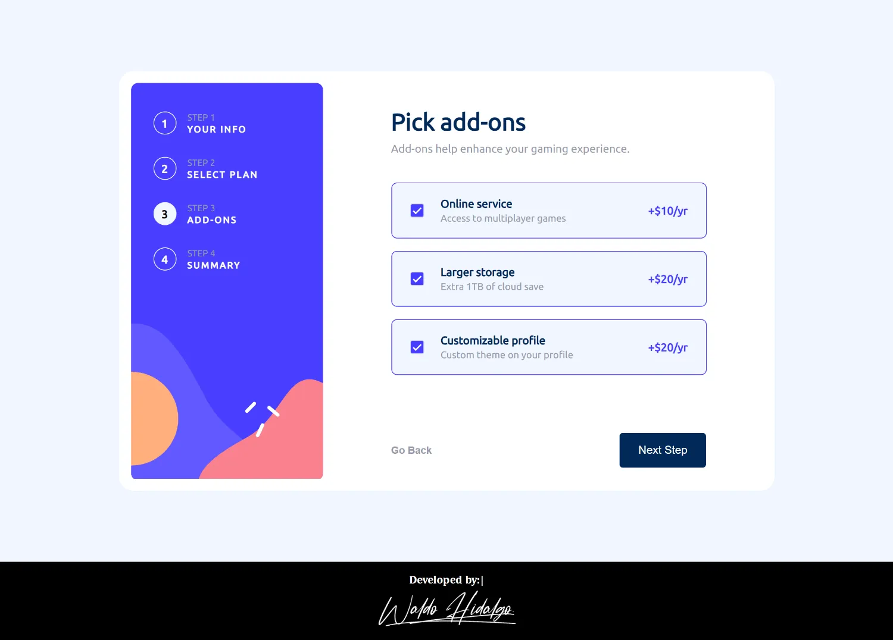

#### 4. Step 4: Summary Yearly Desktop

##### 4.1. Step 4: Summary Monthly Desktop

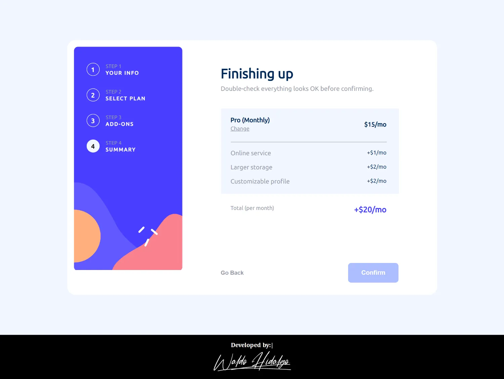

#### 5. Step 5: Thanks Desktop

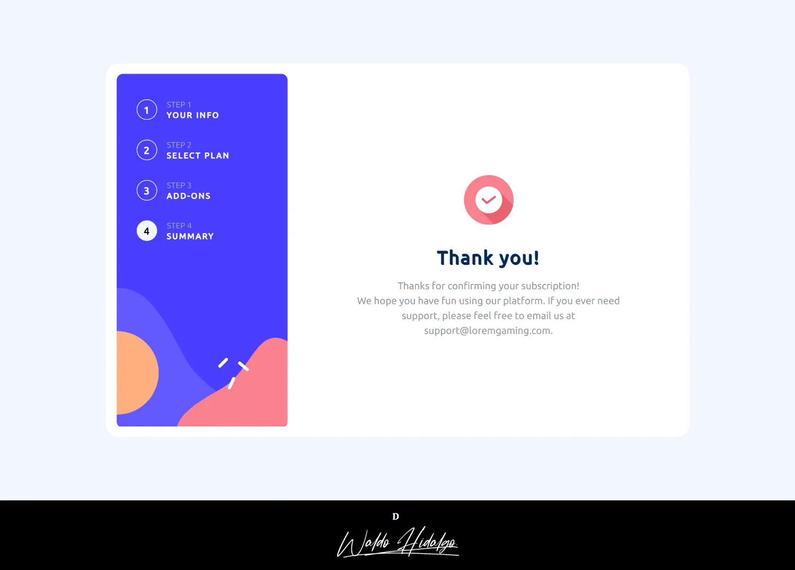

### Views on Mobile size

#### 1. Step 1 Mobile

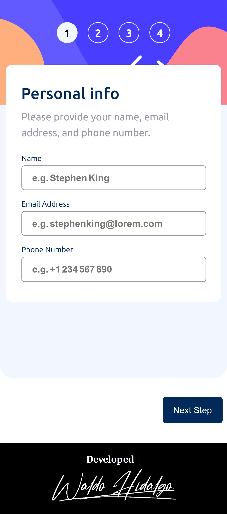

##### 1.1. Step 1 Validaciones Mobile

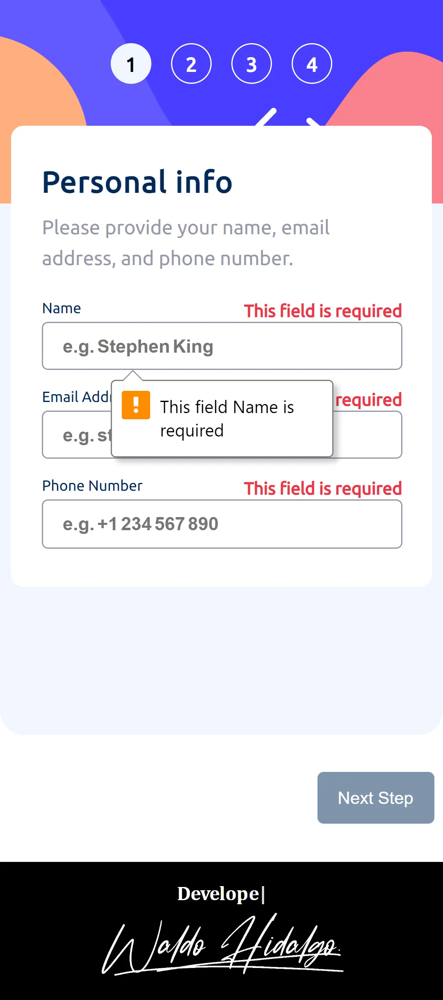

#### 2. Step 2 Plan Monthly Mobile

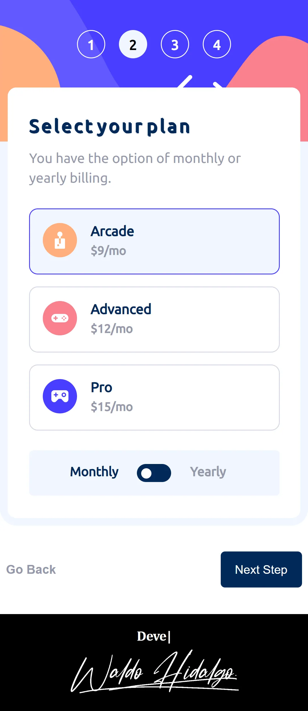

##### 2.1. Step 2 Yearly Mobile

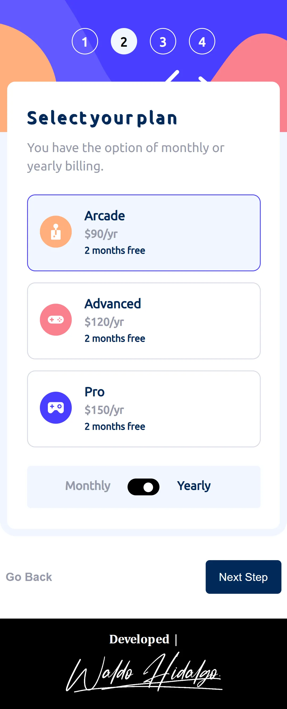

#### 3. Step 3 Add-ons Mobile

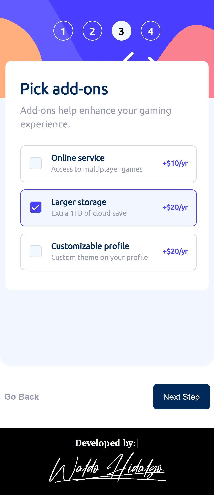

#### 4. Step 4 Summary Mobile

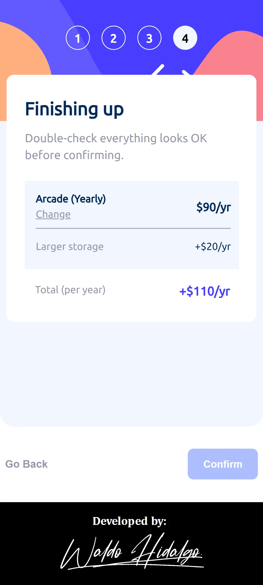

#### 5. Step 5 Thanks Mobile

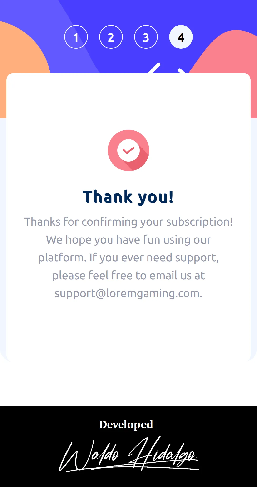
